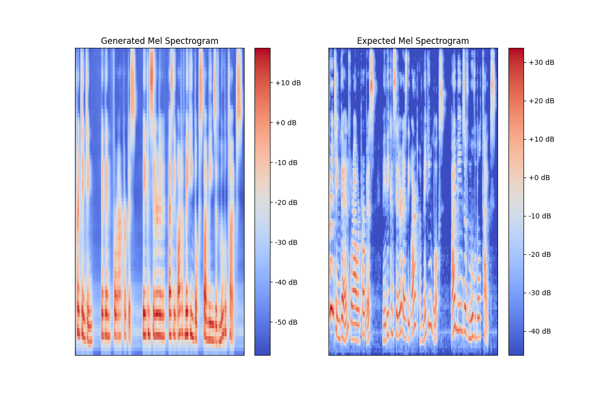

# Mini Transformer Text To Speech
This model is a transformer-based text to speech model that uses self attention mechanism to capture long-range dependecies in text and audio sequence. It tries to replicate the model architecture proposed by Li et al. 2018 (arXiv:1809.08895).

Demo available [here](https://huggingface.co/spaces/haydnllh/Mini-Transformer-TTS)

## Method

Architecture: Embedding Layer -> Encoder/Decoder prenets -> Positional Encoding -> Encoder Block (x3) -> Decoder Block (x3) -> 5 Layer Conv1d Postnet + Stop Token -> Vocoder (Griffin-Lim Algorithm)

Input: Text tokens and log mel-spectrogram

Output: Predicted next frame 

Loss function: Mean Square Error

Optimisation: Adam

Learning rate: 0.001

Regularisation: L2 = 1e-6

## Dataset

Used the LJSpeech Dataset to train the model. Preprocessed to convert sentences into phonemes.

Link: https://keithito.com/LJ-Speech-Dataset/

## Training

Hardware: NVIDIA GeForce GTX 1660

Epochs: 500

## Results

Mean Opinion Score of 3.2 from 5 testers.

Input: Printing, then, for our purpose, may be considered as the art of making books by means of movable types.

Output:

## Limitations

- Struggles with very short or very long sequences
- Training time increases linearly when scaled up
- Output tends to smoothen the finer details of the original signal
- Vocoder uses the Griffin-Lim algorithm which makes the generated audio sounds "robotic" and "unnatural"

## References
- Li, Naihan, et al. "Neural speech synthesis with transformer network."

